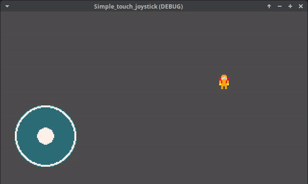

A simple touch joystick, made using Godot 4.3

I'm still a beginner so don't expect too much haha I just wanted a simple joystick to control my characters direction and nothing more.

To use:
- Add the "touch joy instance" scene to your ui, rename to easy access.
- Whenever you wanna use the direction, import it onto your script and use the "_get_direction()" function. 
- You can change the assets as you like, just open the "joystick touch" scene and change the sprites, just remember to set the touch collsion shape properly for the new size.

- You can retrieve the direction vector like this:

```
extends CharacterBody2D
@onready var joystick_touch: Control = $"../Joystick_touch"

const SPEED = 100.0

func _physics_process(_delta: float) -> void:
	var direction: Vector2 = joystick_touch._get_direction()
	
	velocity = direction * SPEED
	move_and_slide()

```

I've left an example scene on the project, using two simple node2d with sprites, and two joysticks for multitouch, to show it working you can open the project.godot using the Project Manager and test for yourself. You can safely remove the Demo and test_assets folders, they are used only for testing.
And here it's in action:


