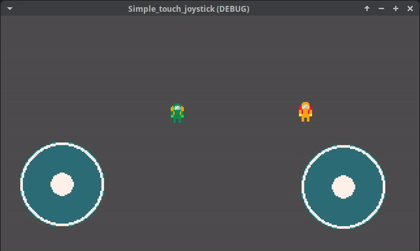

A simple touch joystick, made using Godot 4.3

I'm still a beginner so don't expect too much haha I just wanted a simple joystick to control my characters direction and nothing more.
If you want to anchor this onto your UI, make it a child of a control node, and anchor the control node to the desired location.

The usage is simple:
- add the scene and script to the project, make sure they are linked.
- Import the joystick on the Player script.
- Retrieve the vector2 using the get_direction() function, like this:

```
extends CharacterBody2D
@onready var joystick_touch: TouchScreenButton = $"../Joystick_touch"

const SPEED = 100.0

func _physics_process(_delta: float) -> void:
	var direction: Vector2 = joystick_touch.get_direction()
	
	velocity = direction * SPEED
	move_and_slide()

```
I've left an example scene on the project, using a simple node2d with a sprite to show it working.

And here it's in action:

